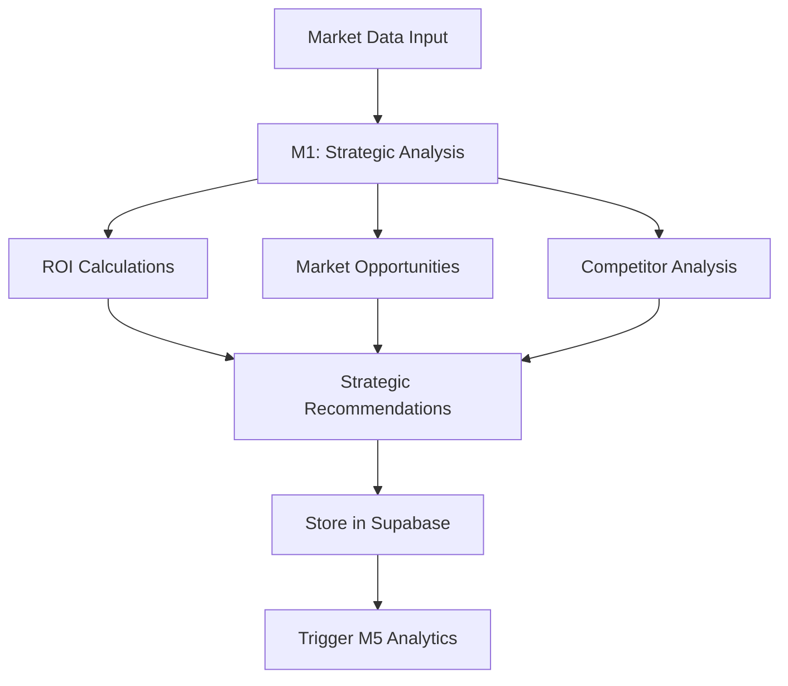
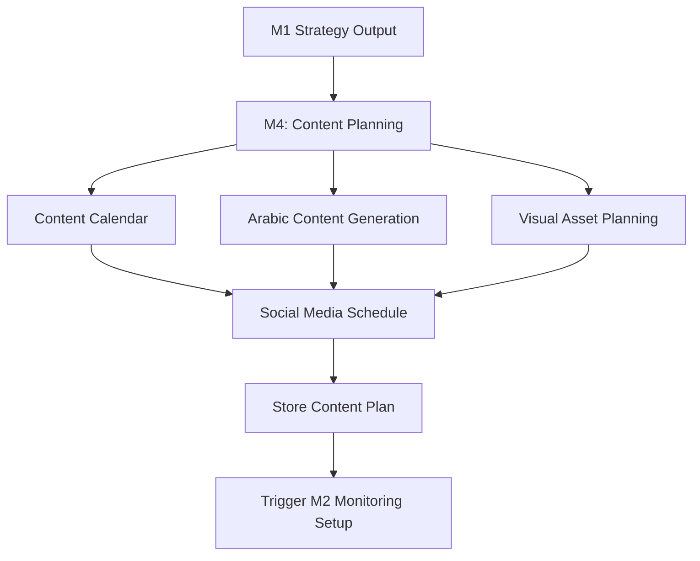
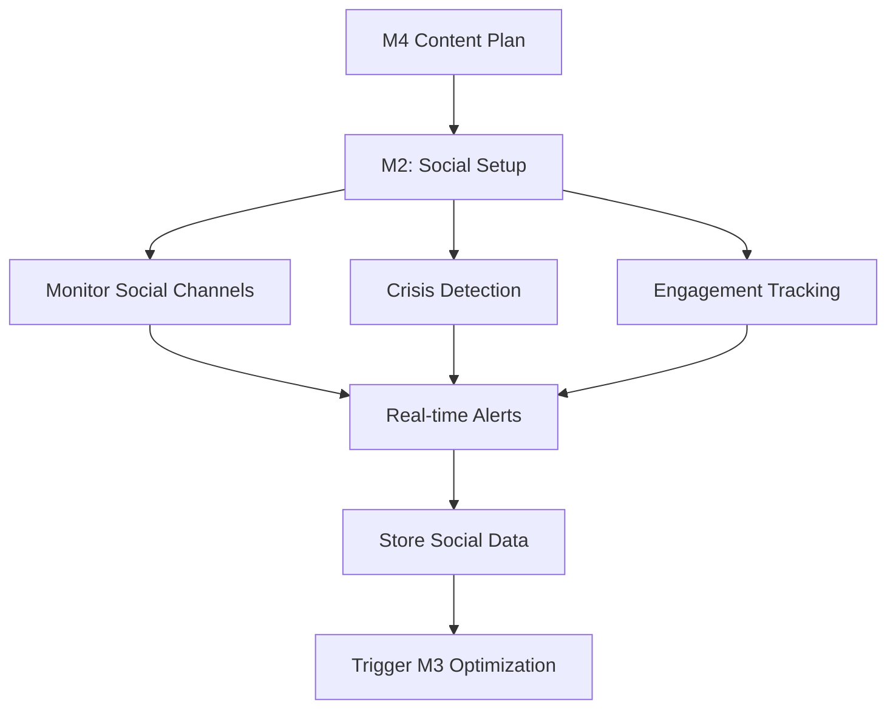
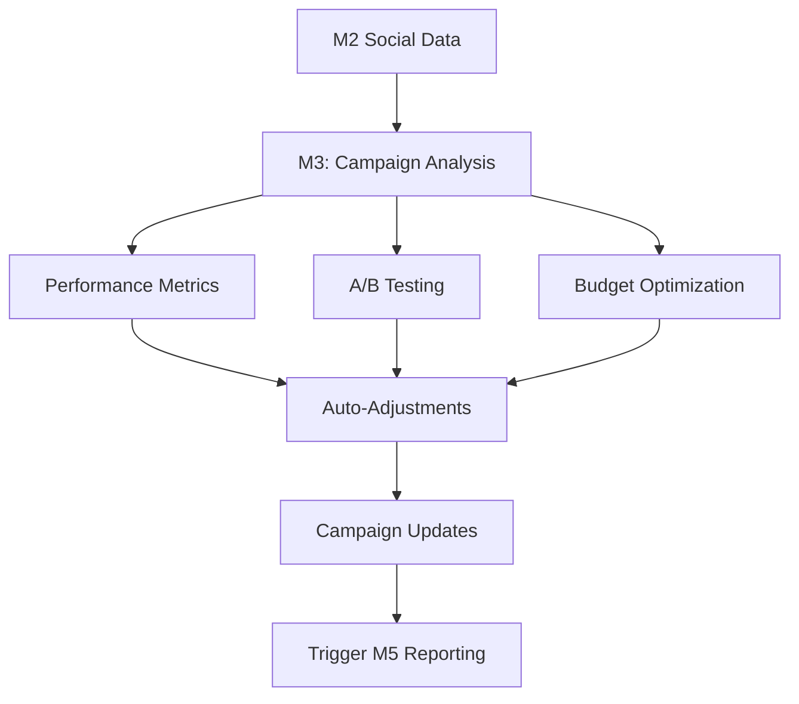
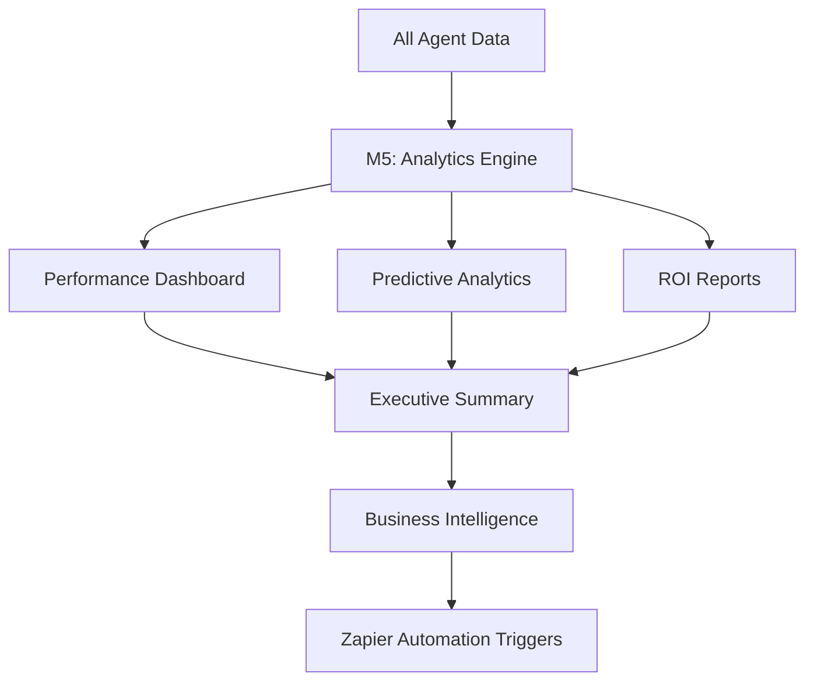

# Morvo AI Marketing Platform - Integration Plan & Workflow

## 🎯 **System Overview**

The Morvo AI Marketing Platform integrates 5 specialized AI agents (M1-M5) with comprehensive backend services, external APIs, and automation workflows for complete marketing automation in Arabic-speaking markets.

---

## 🏗️ **Architecture Overview**

```
┌─────────────────────────────────────────────────────────────────────┐
│                     Morvo AI Marketing Platform                     │
├─────────────────────────────────────────────────────────────────────┤
│  Frontend Dashboard (Arabic/English)                               │
│  ├── Campaign Management                                            │
│  ├── Real-time Analytics                                            │
│  ├── Agent Monitoring                                               │
│  └── Content Calendar                                               │
├─────────────────────────────────────────────────────────────────────┤
│  FastAPI Backend (Railway Deployment)                              │
│  ├── M1: Strategic Analysis & ROI                                   │
│  ├── M2: Social Media Monitoring                                    │
│  ├── M3: Campaign Optimization                                      │
│  ├── M4: Content Strategy                                           │
│  └── M5: Data Analytics & BI                                        │
├─────────────────────────────────────────────────────────────────────┤
│  Data Layer (Supabase)                                             │
│  ├── Agent Results Storage                                          │
│  ├── Campaign Data                                                  │
│  ├── Analytics Database                                             │
│  └── User Management                                                │
├─────────────────────────────────────────────────────────────────────┤
│  External Integrations                                              │
│  ├── Social Media APIs (Facebook, Twitter, LinkedIn)               │
│  ├── Analytics APIs (Google Analytics, Ads)                        │
│  ├── Business Intelligence (SEMrush, Ahrefs)                       │
│  └── Automation (Zapier, Make, IFTTT)                              │
└─────────────────────────────────────────────────────────────────────┘
```

---

## 🤖 **M1-M5 Agent Integration Workflow**

### **Phase 1: Strategic Analysis (M1)**


**M1 Endpoints:**
- `POST /api/v2/agents/m1/strategic-analysis`
- Input: Market data, budget, goals
- Output: Strategic recommendations, ROI projections

### **Phase 2: Content Strategy (M4)**


**M4 Endpoints:**
- `POST /api/v2/agents/m4/content-strategy`
- Input: Strategic goals, target audience
- Output: Content calendar, Arabic content, asset requirements

### **Phase 3: Social Media Monitoring (M2)**


**M2 Endpoints:**
- `POST /api/v2/agents/m2/social-monitoring`
- Input: Channels to monitor, keywords, brand mentions
- Output: Real-time social insights, crisis alerts

### **Phase 4: Campaign Optimization (M3)**


**M3 Endpoints:**
- `POST /api/v2/agents/m3/campaign-optimization`
- Input: Campaign data, performance metrics
- Output: Optimization recommendations, auto-adjustments

### **Phase 5: Data Analytics & BI (M5)**


**M5 Endpoints:**
- `POST /api/v2/agents/m5/data-analytics`
- Input: All platform data, timeframes
- Output: Comprehensive analytics, predictions, reports

---

## 🔄 **Combined Crew Workflows**

### **1. Market Analysis Crew (M1 + M5)**
```bash
POST /api/v2/crews/market-analysis
```
- M1 analyzes market opportunities
- M5 provides data-driven insights
- Combined: Strategic market positioning

### **2. Content & Social Crew (M2 + M4)**
```bash
POST /api/v2/crews/content-social
```
- M4 creates content strategy
- M2 monitors social performance
- Combined: Optimized content distribution

### **3. Campaign Execution Crew (M3 + M2 + M5)**
```bash
POST /api/v2/crews/campaign-execution
```
- M3 optimizes campaign performance
- M2 monitors social impact
- M5 provides analytics feedback
- Combined: Full campaign management

### **4. Complete Marketing Automation (M1-M5)**
```bash
POST /api/v2/marketing/complete-automation
```
- All agents work in orchestrated workflow
- Real-time optimization and monitoring
- Comprehensive marketing automation

---

## 🚀 **Deployment Workflow**

### **Step 1: Local Development Setup**
```bash
# 1. Clone repository
git clone <your-repo>
cd crewai

# 2. Install dependencies
pip install -r requirements.txt

# 3. Configure environment
cp .env.example .env
# Edit .env with your credentials

# 4. Run locally
python -m uvicorn morvo_integration_api:app --reload --port 8000

# 5. Test endpoints
curl http://localhost:8000/health
```

### **Step 2: Supabase Backend Setup**
```sql
-- 1. Create tables for agent results
CREATE TABLE agent_results (
    id UUID DEFAULT gen_random_uuid() PRIMARY KEY,
    agent_id VARCHAR(10) NOT NULL,
    task_type VARCHAR(100) NOT NULL,
    input_data JSONB,
    output_data JSONB,
    status VARCHAR(20) DEFAULT 'completed',
    created_at TIMESTAMP DEFAULT NOW(),
    updated_at TIMESTAMP DEFAULT NOW()
);

-- 2. Create indexes for performance
CREATE INDEX idx_agent_results_agent_id ON agent_results(agent_id);
CREATE INDEX idx_agent_results_created_at ON agent_results(created_at);

-- 3. Set up RLS (Row Level Security)
ALTER TABLE agent_results ENABLE ROW LEVEL SECURITY;
```

### **Step 3: Railway Deployment**
```bash
# 1. Connect Railway to GitHub
railway login
railway link

# 2. Set environment variables in Railway dashboard
OPENAI_API_KEY=your_key
SUPABASE_URL=your_url
SUPABASE_KEY=your_key
# ... all other .env variables

# 3. Deploy
git push origin main
# Railway auto-deploys from railway.toml

# 4. Verify deployment
curl https://your-app.railway.app/health
```

### **Step 4: Automation Setup**
```javascript
// Zapier Integration Example
const zapierWebhook = async (data) => {
    await fetch('https://hooks.zapier.com/hooks/catch/your-webhook', {
        method: 'POST',
        headers: { 'Content-Type': 'application/json' },
        body: JSON.stringify({
            agent: data.agent_id,
            task: data.task_type,
            results: data.output_data,
            timestamp: data.created_at
        })
    });
};
```

---

## 📊 **Data Flow & Processing**

### **Real-time Data Pipeline**
```
Input Data → Agent Processing → Results Storage → Analytics → Automation Triggers
     ↓              ↓               ↓              ↓              ↓
  API Calls → M1-M5 Agents → Supabase DB → M5 Analytics → Zapier/Make
     ↓              ↓               ↓              ↓              ↓
  Validation → Background Tasks → Redis Cache → Dashboards → Email/Slack
```

### **Storage Strategy**
- **Hot Data**: Redis cache (real-time metrics)
- **Warm Data**: Supabase (recent agent results)
- **Cold Data**: S3/Cloud Storage (historical analytics)

---

## 🔗 **External Integrations**

### **Social Media APIs**
```python
# Facebook/Meta
facebook_config = {
    'access_token': os.getenv('FACEBOOK_ACCESS_TOKEN'),
    'app_id': os.getenv('FACEBOOK_APP_ID'),
    'app_secret': os.getenv('FACEBOOK_APP_SECRET')
}

# Twitter/X
twitter_config = {
    'api_key': os.getenv('TWITTER_API_KEY'),
    'api_secret': os.getenv('TWITTER_API_SECRET'),
    'access_token': os.getenv('TWITTER_ACCESS_TOKEN'),
    'access_token_secret': os.getenv('TWITTER_ACCESS_TOKEN_SECRET')
}
```

### **Analytics Integrations**
```python
# Google Analytics
ga_config = {
    'property_id': os.getenv('GA_PROPERTY_ID'),
    'credentials_json': os.getenv('GA_CREDENTIALS_JSON')
}

# Google Ads
gads_config = {
    'customer_id': os.getenv('GOOGLE_ADS_CUSTOMER_ID'),
    'developer_token': os.getenv('GOOGLE_ADS_DEVELOPER_TOKEN'),
    'oauth2_credentials': os.getenv('GOOGLE_ADS_OAUTH2_CREDENTIALS')
}
```

### **Business Intelligence APIs**
```python
# SEMrush
semrush_config = {
    'api_key': os.getenv('SEMRUSH_API_KEY'),
    'base_url': 'https://api.semrush.com'
}

# Ahrefs
ahrefs_config = {
    'api_token': os.getenv('AHREFS_API_TOKEN'),
    'base_url': 'https://apiv2.ahrefs.com'
}
```

---

## 🧪 **Testing Strategy**

### **Unit Tests**
```bash
# Test individual agents
pytest tests/test_m1_strategic.py
pytest tests/test_m2_social.py
pytest tests/test_m3_campaign.py
pytest tests/test_m4_content.py
pytest tests/test_m5_analytics.py
```

### **Integration Tests**
```bash
# Test agent workflows
pytest tests/test_crew_workflows.py
pytest tests/test_complete_automation.py
```

### **API Tests**
```bash
# Test all endpoints
pytest tests/test_api_endpoints.py --cov=morvo_integration_api
```

### **Load Testing**
```bash
# Test performance under load
locust -f tests/load_test.py --host=https://your-app.railway.app
```

---

## 📈 **Monitoring & Observability**

### **Health Checks**
- **Endpoint**: `GET /health`
- **Database**: Supabase connection status
- **External APIs**: Response time monitoring
- **Agent Status**: Individual M1-M5 health

### **Metrics Collection**
```python
# Prometheus metrics
from prometheus_client import Counter, Histogram

agent_requests = Counter('agent_requests_total', 'Total agent requests', ['agent_id'])
agent_duration = Histogram('agent_duration_seconds', 'Agent processing time', ['agent_id'])
```

### **Error Tracking**
```python
# Sentry integration
import sentry_sdk
from sentry_sdk.integrations.fastapi import FastApiIntegration

sentry_sdk.init(
    dsn=os.getenv('SENTRY_DSN'),
    integrations=[FastApiIntegration()],
    traces_sample_rate=0.1
)
```

---

## 🔄 **Automation Workflows**

### **Daily Automation Schedule**
```
06:00 → M1: Market analysis (global markets open)
08:00 → M4: Content generation for the day
10:00 → M2: Social media monitoring activation
12:00 → M3: Mid-day campaign optimization
16:00 → M5: Performance analytics report
18:00 → M2: Evening social engagement analysis
22:00 → M1: Next-day strategic planning
```

### **Trigger-based Automation**
```javascript
// Crisis detection trigger
if (sentiment_score < -0.7) {
    triggerZapier('crisis_management', {
        severity: 'high',
        channel: social_channel,
        message: crisis_message
    });
}

// ROI optimization trigger
if (campaign_roi < target_roi) {
    triggerM3Optimization({
        campaign_id: campaign.id,
        optimization_type: 'budget_reallocation'
    });
}
```

---

## 📋 **Implementation Checklist**

### **Phase 1: Core Setup** ✅
- [x] FastAPI backend with M1-M5 endpoints
- [x] Supabase database configuration
- [x] Railway deployment setup
- [x] Environment variables configuration
- [x] Security implementation (API keys, CORS)

### **Phase 2: Agent Integration** 🔄
- [ ] Implement M1 strategic analysis logic
- [ ] Implement M2 social media monitoring
- [ ] Implement M3 campaign optimization
- [ ] Implement M4 content strategy
- [ ] Implement M5 data analytics

### **Phase 3: External Integrations** 📋
- [ ] Social media API connections
- [ ] Analytics API integrations
- [ ] Business intelligence APIs
- [ ] Zapier/Make automation setup

### **Phase 4: Testing & Optimization** 📋
- [ ] Unit testing for all agents
- [ ] Integration testing workflows
- [ ] Load testing and performance optimization
- [ ] Security testing and penetration testing

### **Phase 5: Production Deployment** 📋
- [ ] Production environment setup
- [ ] Monitoring and alerting
- [ ] Documentation and training
- [ ] Go-live and user onboarding

---

## 🎯 **Success Metrics**

### **Technical KPIs**
- API response time < 2 seconds
- 99.9% uptime availability
- Agent processing success rate > 95%
- Database query performance < 100ms

### **Business KPIs**
- Campaign ROI improvement > 25%
- Social engagement increase > 40%
- Content conversion rate > 15%
- Marketing automation efficiency > 80%

---

## 🔧 **Next Steps**

1. **Complete Agent Implementation** - Finish M1-M5 agent logic
2. **External API Integration** - Connect all social media and analytics APIs
3. **Frontend Dashboard** - Build Arabic/English dashboard
4. **Automation Setup** - Configure Zapier/Make workflows
5. **Production Testing** - Comprehensive testing before launch
6. **Go-Live** - Deploy to production with monitoring

---

*This integration plan provides a comprehensive roadmap for deploying the Morvo AI Marketing Platform with all M1-M5 agents, external integrations, and automation workflows.*
